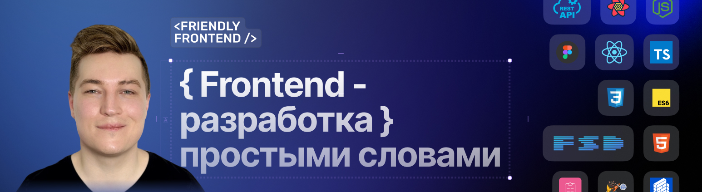

# 👋🏻 Привет, я Александр Ламков!

* 🧐 Фронтенд-инженер самоучка
* 💻 5+ лет опыта коммерческой разработки
* 💼 Работаю в <a href="https://team.vk.company/" target="_blank">VK Team</a>
* 🎓 Окончил магистратуру по направлению _Software engineering_
* 

  
🔧 Стек технологий

  - HTML (HTML5), EJS, JSX
  - CSS (CSS3), Sass (SCSS), PostCSS, Bootstrap, Tailwind, Animations
  - JavaScript (ES6+, OOP), jQuery, TypeScript
  - React
  - Redux (Redux Toolkit, Redux Persist), Zustand
  - Formik, React Hook Form, Yup, Axios, React Router, React Query
  - Webpack, Vite, Gulp, Rollup
  - ESLint, Stylelint, Prettier
  - Jest, React Testing Library, Enzyme, Chai, Mocha, Vitest
  - REST API, WebSockets, Long Polling
  - BEM, Feature-Sliced Design, Accessibility, UX
  - Git (GitHub, BitBucket, GitLab)
  - Figma, Adobe Photoshop, Avocode
  - CMS 1С-Битрикс, Drupal, OpenCart, MODX
  - CRM Битрикс24, Asana, Trello, Jira, Notion
  - PHP, Blade, Twig
  - Agile, Waterfall, SCRUM
  

* 📺 Автор <a href="https://www.youtube.com/@AleksanderLamkov" target="_blank">YouTube-канала</a> про фронтенд-разработку
* 💬 Развиваю сообщество <a href="https://t.me/FriendlyFrontend" target="_blank">Friendly Frontend Community</a> для новичков во фронтенд-разработке

### 📺 Где меня посмотреть / послушать / почитать
- <a href="https://www.youtube.com/@AleksanderLamkov" target="_blank"> YouTube</a>
- <a href="https://t.me/AleksanderLamkov" target="_blank"> Telegram</a>
- <a href="https://dzen.ru/aleksanderlamkov" target="_blank"> Дзен</a>
- <a href="https://rutube.ru/channel/39067233/" target="_blank"> Rutube</a>
- <a href="https://www.tiktok.com/@aleksanderlamkov" target="_blank"> TikTok</a>
- <a href="https://www.instagram.com/a1rth" target="_blank"> Instagram</a>

### 🎙 Интервью со мной:
- Всё про FRONTEND | С Чего начать | Работа в VK | Roadmap | Большие зарплаты | Александр Ламков
  - <a href="https://youtu.be/DD5v6p4fFQg" target="_blank"> YouTube</a>
  - <a href="https://dzen.ru/video/watch/67fbc037a35c9016d914693f" target="_blank"> Дзен</a>
  - <a href="https://rutube.ru/video/0743b60b6e3d3c78ff7f2c77325d618b/" target="_blank"> Rutube</a>
  - <a href="https://vk.com/video-229700318_456239050" target="_blank"> VK</a>

### 🙈 Менторство, платные материалы, поддержка донатом
- <a href="https://getmentor.dev/mentor/aleksandr-lamkov-1480" target="_blank"> GetMentor</a>
- <a href="https://stepik.org/users/1001545715/teach" target="_blank"> Stepik</a>
- <a href="https://boosty.to/friendly-frontend" target="_blank"> Boosty</a>

### 📚 Мои бесплатные курсы:
- <a href="https://www.youtube.com/playlist?list=PL0MUAHwery4ot0KmgGxlBSB7rXssLeA6h" target="_blank"> HTML с 0 для начинающих</a>
- <a href="https://www.youtube.com/playlist?list=PL0MUAHwery4o9I7QQVj_RP4ZVpmdx6evz" target="_blank"> CSS с 0 для начинающих</a>
- <a href="https://www.youtube.com/playlist?list=PL0MUAHwery4qn4Y27iUxmzC-JiauX7vSL" target="_blank"> JavaScript с 0 для начинающих</a>
- <a href="https://www.youtube.com/playlist?list=PL0MUAHwery4r4gCA3AOtHgArM_UOb2QUV" target="_blank"> Accessibility (мини-курс) </a>
- <a href="https://youtu.be/eMETcugEX_c" target="_blank"> Git для начинающих (мини-курс)</a>
- <a href="https://youtube.com/playlist?list=PL0MUAHwery4omH4GyVQ-lI2R326tOdN7A" target="_blank"> React JS с 0 для начинающих</a>

### 💻 Мои мастер-классы по разработке:
- 👨‍💻<a href="https://www.youtube.com/playlist?list=PL0MUAHwery4rqkzKF1mDBCIH_eZgjY6uN" target="_blank"> Адаптивная верстка сайта с 0 для начинающих | HTML, CSS, Figma практика (3.5 часа практики)</a>
- 🧑‍💻<a href="https://www.youtube.com/playlist?list=PL0MUAHwery4rdZt-8E9p9zty2ZUCH6Ai3" target="_blank"> Адаптивная верстка сайта с 0 для начинающих | HTML, БЭМ, SCSS, Figma практика (4 часа практики)</a>
- 🧑‍💻<a href="https://youtu.be/hkYzqTKnSIg" target="_blank"> Вёрстка сайта с нуля • HTML, SCSS, JS практика • Подробное объяснение по шагам • Проект в портфолио (12 часов практики)</a>
- 🧑‍💻<a href="https://stepik.org/a/228315" target="_blank"> Вёрстка сайта с нуля • JSX, SCSS, JS, Vite, Minista, БЭМ (16 часов практики)</a>
- <a href="https://youtu.be/tBl1n9VPdMk" target="_blank"> To Do List на чистом JavaScript — без фреймворков и библиотек</a>

### ⭐ Мои избранные видеоматериалы:
- <a href="https://www.youtube.com/@AleksanderLamkov/shorts" target="_blank"> Frontend Tricks & Tips (Shorts)</a>
- <a href="https://www.youtube.com/playlist?list=PL0MUAHwery4qW_mKistLNWlh5ss1tstNi" target="_blank"> Редкие и малоизвестные фичи DevTools, о которых ты не знал</a>
- 👨‍🏫 <a href="https://youtu.be/1WRJKgwlX9w?si=c11wdZqqMfa-B3xL" target="_blank">Frontend Roadmap 2024 | Что должен учить фронтенд-разработчик в 2024-2025 году</a>
- <a href="https://youtu.be/pBSch5AsJWs?si=VXcpbKTIBCu9BBwu" target="_blank"> Ускоряем верстку | Гайд по препроцессору стилей | Sass (SCSS)</a>
- <a href="https://youtu.be/FH-t1mt-lSs?si=rTjJBYuirBi8xx4a" target="_blank"> БЭМ методология за 10 минут | Основы для начинающих</a>
- 🤔 <a href="https://youtu.be/EVWT4exv4jA" target="_blank">Имена классов в верстке | Как лучше называть элементы в разметке</a>
- <a href="https://youtu.be/IsRl03T9VMo" target="_blank"> NPM для начинающих. Полный гайд: установка, команды, флаги, разбор package.json, версионирование</a>
- <a href="https://youtu.be/PLU2AuU6wlU" target="_blank"> WebStorm настройки для быстрой и удобной работы • Плагины • Git GUI • Шаблоны и сниппеты • Обзор IDE</a>
- <a href="https://youtu.be/Ib7Pj38m0wQ" target="_blank"> Vite — лучший сборщик для фронтенда в 2025: почему его выбирают все</a>
- <a href="https://youtu.be/WoolADiqRE8" target="_blank"> Как писать сайты на JSX (без React) и собирать их через Vite: Minista в деле</a>
- <a href="https://youtu.be/jwTwnI3hwig" target="_blank"> Линтеры и форматтеры в фронтенде: ESLint, Stylelint и Prettier без боли</a>
- <a href="https://youtu.be/0nqwWprv5Qs" target="_blank"> Мой стартовый шаблон для вёрстки: Minista + JSX + Vite — без Gulp и Webpack</a>

### 🔬 Open-Source проекты:
- CSS Normalize — современная нормализация стилей
  -  <a href="https://github.com/aleksanderlamkov/css-normalize" target="_blank">GitHub</a>
  -  <a href="https://www.npmjs.com/package/@a1rth/css-normalize" target="_blank">NPM</a>
  -  <a href="https://www.youtube.com/watch?v=A4Y5VwXGG9g&t=262s" target="_blank">YouTube</a>
- Friendly Frontend Lint Config — общие конфигурации для линтеров и форматтеров во фронтенд-проектах
  -  <a href="https://github.com/aleksanderlamkov/friendly-frontend-lint-config" target="_blank">GitHub</a>
  -  <a href="https://www.npmjs.com/package/friendly-frontend-lint-config" target="_blank">NPM</a>
  -  <a href="https://www.youtube.com/watch?v=0nqwWprv5Qs&t=836s" target="_blank">YouTube</a>
- Create Friendly Frontend — удобный старт для вёрстки с JSX
  -  <a href="https://github.com/aleksanderlamkov/create-friendly-frontend" target="_blank">GitHub</a>
  -  <a href="https://www.npmjs.com/package/create-friendly-frontend" target="_blank">NPM</a>
  -  <a href="https://youtu.be/0nqwWprv5Qs" target="_blank">YouTube</a>
- Статьи и FAQ на <a href="https://doka.guide/people/aleksanderlamkov/" target="_blank">doka.guide</a>
